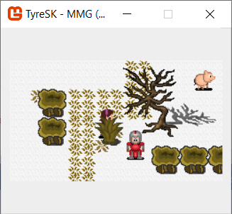
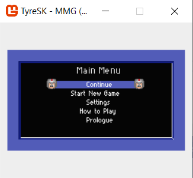
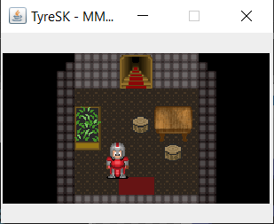
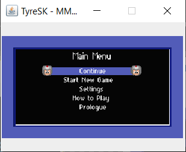

# MmgGameApi - TyreSK
A port of the T-Mobile SideKick game Tyre to the MmgGameApi.
This project includes both a C#, Visual Studio implementation and a Java, NetBeans implementation.
It is designed to plug into the MmgGameApiCs or MmgGameApiJava projects.
 
The game is an RPG that was built to run on the T-Mobile SideKick line of phone. As such it is tiny, 240x136, in size.
You can use this project as an example of the game engine is use for a slightly more advanced implementation.

This is a stable release and most screens have been tested. There may be some issue still. I'll have more work done on the project, if need be, in the near future.

Controls: A = submit, B = back, D-pad = movement

Close the window to exit and save. Make sure you're out of any key battles just to be safe.

Screen Shots:

[comment]: #sc1

[comment]: #sc2

[comment]: #sc3

[comment]: #sc4

This project is a great example of using the game engine and demonstrates the major differences between the C# and Java platforms.
